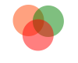

# *gloss*
A autodiff and ndarray library for rust
 

## Organization
This crate has a few different subsections.
* tensor = this contains all of the ndarray constructors and operations
* graph = this contains all of the autodiff rules

Together these are combined and can be used in a tracker object.

[google.com](https://google.com)